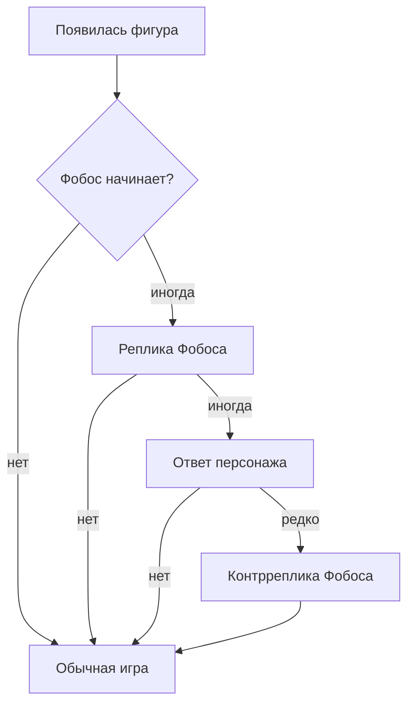

# Следующая сборка — новые мини-игры и диалоги при появлении фигур

Статус после решения автора для v6.37: три одноэкранные игры подключены к Collection; Hay Lin Rescue удалена. Диалоговый код остаётся изолированным исследовательским прототипом и не импортируется основной игрой.

Субтитры внутри Tetris отклонены: они отвлекают от стакана. Каскад длинных реплик также не включён, потому что одна беседа может пережить несколько падающих фигур. Если идея вернётся, она должна работать только с короткими аудиофразами, не задерживать управление и допускаться на всех сюжетных этапах, где соответствующие персонажи ещё присутствуют.

## Короткий вывод

Для ближайшей сборки лучше выбрать **одну или две** новые мини-игры, а не добавлять все сразу. Самые безопасные кандидаты:

1. **Portal Relay / Разломы Завесы** — головоломка Вилл с вращением каналов портала.
2. **Elemental Seal / Печати стихий** — быстрая игра на выбор правильной Стражницы.
3. **Rebel Courier / Связной повстанцев** — трёхполосный маршрут Калеба с заранее видимыми патрулями.

У первых двух уже есть почти все основные персонажные изображения. Они не повторяют существующие Snake, Runner, Breakout и Shooter и не требуют синхронизации с музыкой.

Во всех вариантах действует единое правило: **финальной победы нет**. За выполненную задачу игрок получает очки и следующую, более трудную волну. Темп растёт, пока герой неизбежно не проиграет. Это не техническая случайность, а часть издевательства Фобоса.

## Кандидаты на новые мини-игры

| Приоритет | Игра | Основная механика | Лоровое обоснование | Объём работы | Решение |
|---|---|---|---|---|---|
| 1 | Portal Relay | Вращать участки магического канала и соединить Сердце с порталом | Вилл управляет Сердцем Кандракара и порталами между Землёй и Меридианом | Средний | Рекомендуется |
| 2 | Elemental Seal | Быстро выбирать Стражницу, соответствующую печати стихии | Команда объединяет Землю, Воду, Огонь, Воздух и силу Сердца | Низкий/средний | Рекомендуется |
| 3 | Rebel Courier | Выбирать безопасную полосу по предупреждениям о патрулях | Калеб проводит связного через улицы Меридиана и посты Фобоса | Средний | Рекомендуется |
| 4 | Cedric Book Cipher | Запоминать возрастающие последовательности книжных рун | Седрик скрывался на Земле под образом владельца книжного магазина и собирал сведения | Средний | Подходит после получения арта |
| 5 | Light of Meridian | Балансировать три источника света, пока тьма выводит их из равновесия | Элион связана со Светом Меридиана и восстановлением мира после власти Фобоса | Средний | Подходит, но нет спрайта Элион |
| 6 | Windows of Meridian | Находить изменившееся окно или силуэт во дворце | Окна и город уже стали визуальным мотивом тайной комнаты Фобоса | Низкий | Хорошая секретная игра |
| 7 | Guardian Switch | За короткое время собирать комбинации из двух сил | Стражницы часто решают угрозу совместным применением стихий | Высокий | Лучше после Elemental Seal |
| 8 | Siege of the Palace | Защищать позиции повстанцев от нескольких типов стражи | Финальные бои сопротивления за Меридиан | Очень высокий | Пока отложить |

## 1. Portal Relay / Разломы Завесы

### Игровой цикл

- На сетке находятся прямые и угловые каналы.
- Игрок двигает курсор и вращает выбранную клетку.
- Свет Сердца распространяется только через взаимно соединённые стороны.
- Когда свет достигает портала Меридиана, засчитывается пройденная волна, но не победа.
- Сразу создаётся следующая, более трудная сетка; таймер и давление Фобоса продолжаются до Game Over.

### Почему подходит

- Механика отличается от всех 15 существующих мини-игр.
- Можно полностью управлять стрелками и одной кнопкой, включая 3DS.
- Не требуется физический движок или синхронизация с MP3.
- Генератор строит заведомо решаемую карту; это исключает бесконечные недостижимые раунды.

### Уже имеющиеся материалы

- `assets/minigames/will_face.png`;
- `assets/effects/heart_kandrakar.png`;
- `assets/audio/sfx/heart_portal.wav`;
- несколько изображений Вилл из кат-сцен.

### Желательные новые материалы

- фон разлома Завесы — `1000x1000`, PNG или JPG;
- портал Меридиана: закрытый, активный и открытый — 3 PNG с прозрачностью;
- 4–6 кадров свечения Сердца;
- необязательный отдельный MP3 длительностью 1–3 минуты;
- короткие SFX: поворот клетки, правильное соединение, открытие портала.

Саму графику трубок можно рисовать кодом, поэтому отдельный спрайт для каждого соединения не обязателен.

## 2. Elemental Seal / Печати стихий

### Игровой цикл

- В центре появляется печать Земли, Воды, Огня, Воздуха или Сердца.
- Игрок выбирает правильную Стражницу одной из пяти кнопок.
- Верные ответы повышают комбо и ускоряют появление печатей.
- Ошибка отнимает жизнь и сбрасывает комбо.
- Позже могут появиться двойные печати, требующие двух персонажей по порядку.

### Почему подходит

- Использует саму команду W.I.T.C.H., а не только одного героя.
- Работает и без новых анимаций: на первом этапе достаточно портретов.
- Поддерживает клавиатуру, геймпад и 3DS.
- Можно использовать существующие голосовые записи стихий как награду за серию правильных ответов.

### Уже имеющиеся материалы

- изображения всех пяти Стражниц в кат-сценах;
- портреты Вилл и Ирмы;
- голосовые файлы Земли, Воды, Огня и Воздуха;
- изображение Сердца Кандракара.

### Необходимые материалы

- пять хорошо различимых значков стихий с прозрачностью;
- желательно по одному игровому портрету одинакового размера для Вилл, Ирмы, Тарани, Корнелии и Хай Лин;
- звук правильного ответа и звук ошибки;
- отдельная короткая реплика Вилл для силы Сердца — сейчас тематические голосовые пулы есть только у четырёх стихий;
- необязательный фоновый MP3.

## 3. Rebel Courier / Связной повстанцев

### Игровой цикл

- Калеб движется по трём полосам улиц Меридиана.
- На несколько шагов вперёд видны посты и патрули Фобоса.
- За один ход можно остаться на полосе или перейти на соседнюю.
- Столкновение отнимает жизнь, безопасный проход приносит очки.
- Каждая карта заранее проверяется на существование проходимого маршрута.

### Отличие от Caleb Runner

Это не реактивный прыжок через препятствия. Новая игра построена на чтении маршрута и коротком планировании: игрок заранее видит опасность и выбирает путь.

### Уже имеющиеся материалы

- `assets/minigames/caleb.png`;
- несколько изображений Калеба из вступления и сцены 100 линий;
- одна голосовая реплика Калеба.

### Необходимые материалы

- фон улицы или тоннелей Меридиана;
- 2–3 силуэта стражников Фобоса;
- значок тайного послания;
- три небольших кадра Калеба: движение влево, прямо и вправо;
- SFX тревоги и успешной доставки;
- напряжённый, но не ритмический MP3.

## 4. Cedric Book Cipher / Книжный шифр Седрика

### Игровой цикл

- На полках вспыхивает последовательность из 3 книжных рун.
- Игрок повторяет её.
- После каждого раунда добавляется ещё один символ.
- Ошибка возвращает показ последовательности и отнимает жизнь.
- Каждая верная последовательность открывает ещё один отсек тайника и добавляет символ; окончательного последнего тайника нет.

### Почему подходит

Это игра на зрительную память, а не на музыкальный ритм. Скорость показа может быть связана с уровнем сложности без привязки к внешнему аудио.

### Уже имеющиеся материалы

- `assets/minigames/cedric_face.png`;
- исходное изображение Седрика в `assets/reference/`.

### Необходимые материалы

- фон книжного магазина;
- шесть квадратных книжных рун;
- Седрик в человеческом облике и, желательно, один кадр превращения;
- открытая и закрытая тайная книга;
- звуки выбора, ошибки и открытия;
- атмосферный MP3 без обязательного совпадения с темпом игры.

## 5. Light of Meridian / Свет Меридиана

### Игровой цикл

- Три источника света постоянно получают случайные всплески тёмной энергии.
- Игрок переносит энергию между соседними источниками.
- Все три показателя нужно удерживать в безопасной зоне.
- Редкая способность Элион снижает порчу, но долго перезаряжается.
- За каждую выдержанную минуту начисляются очки, но порча усиливается до неизбежного Game Over.

### Главный блокер

В репозитории не найдено отдельного игрового спрайта Элион. Без него мини-игра будет выглядеть как абстрактная панель и потеряет связь с мультсериалом.

### Необходимые материалы

- Элион: нейтральная поза, применение силы, получение урона;
- зал дворца или панорама восстановленного Меридиана;
- три источника/кристалла света в двух состояниях;
- тёмная энергия в виде 3–5 кадров;
- реплика Элион и отдельный музыкальный трек.

## Что сейчас не стоит делать

### Новая ритм-игра

Причины те же, что у отменённой Irma Reigning: разметка таймингов, зависимость от конкретного MP3, анимации под темп и сложное тестирование задержки звука. В v6.37 её недостижимые ветки окончательно удалены из `main.py`.

### Ещё один Runner, Shooter, Breakout или Snake

Эти механики уже представлены. Новый персонаж и другой фон не сделают повтор полноценной новой мини-игрой.

### Полноценный платформер или сражение с боссом

Понадобятся десятки анимаций, камеры, физика, атаки, состояния босса и новый интерфейс. Для проекта с одним большим `main.py` риск поломки несоразмерен результату.

### Мини-игра с распознаванием голоса

Она усложнит разрешения микрофона, перенос на другие платформы и сборку. Для 3DS такой вариант особенно неудачен.

## Диалог при появлении фигуры

### Требуемый каскад



Рекомендуемые условные вероятности:

- стартовая фраза Фобоса — `5,5%` появления фигуры;
- ответ персонажа — `30%` после фразы Фобоса;
- контрреплика Фобоса — `20%` после ответа персонажа.

Таким образом, полный разговор из трёх фраз возникнет примерно в `0,33%` появлений фигур. Он будет редким событием, а не постоянной помехой игровому процессу.

### Обязательные ограничения

- минимум 12 новых фигур между разговорами;
- одна конкретная цепочка используется не более одного раза за игру;
- новая цепочка не начинается, пока занят голосовой канал;
- музыка приглушается до конца всей цепочки, а не только первой фразы;
- после победы Стражниц Фобос не говорит;
- после исчезновения Стражниц в обычной ветке Фобоса персонажи не отвечают;
- при паузе, кат-сцене, Game Over или секретном видео очередь замораживается либо безопасно отменяется;
- никаких субтитров поверх Tetris;
- реплика не ставит игру на паузу и не блокирует новую фигуру;
- допускаются только короткие звуковые фразы, которые безопасно прекращаются при кат-сцене или смене этапа.

## Три варианта реализации диалогов

### Вариант A — только аудио

Фобос говорит, затем по окончании файла запускается ответ персонажа.

Плюсы: мало графических изменений.

Минусы: без готовой озвучки система не работает; игрок может не расслышать реплику; сложно тестировать содержание.

### Вариант B — очередь аудио и субтитров — отклонён

Каждая фраза имеет `speaker`, `text` и необязательный `audio_key`. Если файла нет, показывается только текст. Это позволяет сначала написать и протестировать разговоры, а озвучку добавлять постепенно.

Плюсы: понятные паузы и отсутствие одновременного звука.

Минусы: панель отвлекает от Tetris и занимает место рядом со стаканом. В сборку не входит.

### Вариант C — контекстные разговоры

Фразы зависят от высоты стакана, HOLD, повторов фигур, текущей ветки, скорости и количества очищенных линий.

Плюсы: наиболее живое ощущение персонажей.

Минусы: намного больше текста, тестов и условий. Этот слой стоит добавлять только поверх работающего варианта B.

## Что уже подготовлено в прототипе диалогов

- соответствие фигур персонажам: `I/Корнелия`, `J/Тарани`, `L/Хай Лин`, `T/Калеб`, `O/Бланк`, `S/Ирма`, `Z/Вилл`;
- вероятности каждой ступени;
- задержка в количестве появившихся фигур;
- защита от недавних повторов;
- запреты по сюжетным веткам;
- проверка занятого голосового канала;
- очередь, не позволяющая второй фразе перебить первую;
- 14 демонстрационных разговоров — по два на каждого персонажа.

## Нужная озвучка для полного демонстрационного банка

В образце 14 цепочек по три возможные фразы:

- 14 начальных реплик Фобоса;
- 14 ответов персонажей;
- 14 контрреплик Фобоса;
- всего максимум 42 аудиофайла.

Для варианта без субтитров система сможет использовать только полностью озвученные короткие фразы. До получения такого набора она остаётся выключенной.

Предлагаемая структура:

```text
assets/audio/voice/dialogues/phobos/
assets/audio/voice/dialogues/will/
assets/audio/voice/dialogues/irma/
assets/audio/voice/dialogues/cornelia/
assets/audio/voice/dialogues/taranee/
assets/audio/voice/dialogues/hay_lin/
assets/audio/voice/dialogues/caleb/
assets/audio/voice/dialogues/blunk/
```

Файлы лучше называть по идентификаторам из JSON:

```text
will_01_start.wav
will_01_reply.wav
will_01_counter.wav
```

Для голоса предпочтительны чистые WAV или качественные MP3 без длинной тишины в начале и конце. Громкость всех персонажей желательно выровнять до передачи в проект.

## Полный список недостающих данных

### Решения автора

1. Какие одну или две мини-игры брать в ближайшую сборку?
2. Если система вернётся, нужны ли ответы всех семи персонажей, включая Калеба и Бланка?
3. Можно ли одной цепочке повториться после перезапуска новой игры?
4. Какая максимальная длительность одной аудиофразы допустима без отвлечения от Tetris?
5. Может ли реплика начаться во время быстрого падения фигуры, или только сразу после спокойного появления?

### Изображения

- Элион отсутствует полностью;
- нет игровых спрайтов стражников Фобоса;
- нет фона книжного магазина Седрика;
- нет отдельного фона улиц Меридиана для Калеба;
- не хватает единого набора портретов пяти Стражниц одного масштаба;
- нет пяти согласованных значков стихий;
- нет анимации портала для головоломки Вилл.

### Звук

- нет разговорных ответов Ирмы, Корнелии, Тарани и Хай Лин;
- у Калеба есть только ограниченный набор;
- реплики Бланка существуют, но не покрывают новые разговоры;
- нет специальной реплики Вилл для печати Сердца;
- новым мини-играм пока не назначены отдельные MP3;
- нужны короткие интерфейсные SFX для Portal Relay, Elemental Seal и Book Cipher.

### Технические данные

- текущая проверенная среда автора — Python `3.13.15` и Pygame `2.6.1`; для готовой сборки всё ещё нужно определить минимально поддерживаемые версии;
- нужно ли уже сейчас считать управление Nintendo 3DS обязательным ограничением;
- желаемое разрешение и соотношение сторон будущего 3DS-порта;
- разрешены ли процедурно нарисованные элементы, или все игровые объекты должны быть взяты из мультсериала/подготовленных спрайтов.
